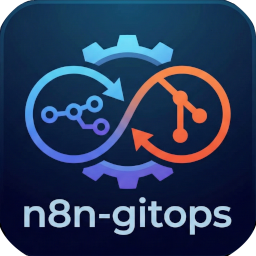

# n8n-gitops

A GitOps CLI tool for [n8n](https://n8n.io) Community Edition that brings version control and collaborative workflow development to n8n.

[](https://github.com/sponsors/byjg)
[](http://opensource.byjg.com)
[](https://github.com/n8n-gitops/n8n-gitops/actions/workflows/build.yml)
[](https://github.com/n8n-gitops/n8n-gitops/)
[](https://opensource.byjg.com/opensource/licensing.html)
[](https://github.com/n8n-gitops/n8n-gitops/releases/)

**n8n** is a fair-code workflow automation platform (like Zapier/Make.com but self-hosted) that connects 400+ services and apps. n8n-gitops adds the Git integration that's missing from the Community Edition.

## Features

- 🔄 **Mirror Mode Export**: Always keeps local repository in perfect sync with n8n
- 📦 **Code Externalization**: Store Python/JavaScript code in separate files
- 🔑 **Credential Documentation**: Auto-generate documentation of workflow credential dependencies
- 🏷️ **Git-Based Deployment**: Deploy specific tags/branches/commits
- ✅ **Validation**: Validate workflows and manifests before deployment
- 🔌 **Active State Management**: Control workflow activation via API endpoints
- 🧹 **Clean Deployments**: Replace workflows with clean state



## Quick Start

```bash
# Install from PyPI
pip install n8n-gitops

# Or install with uv (faster)
uv pip install n8n-gitops

# Create project
n8n-gitops create-project my-n8n-project
cd my-n8n-project

# Configure authentication
cp .n8n-auth.example .n8n-auth
# Edit .n8n-auth with your credentials

# Export workflows
n8n-gitops export

# Commit to Git
git init
git add .
git commit -m "Initial export"
git tag v1.0.0

# Deploy
n8n-gitops deploy --git-ref v1.0.0
```

### Core Guides

- **[Getting Started](getting-started)** - Installation and quick start
- **[Authentication](authentication)** - Configure API credentials
- **[Export](export)** - Mirror workflows from n8n
- **[Deployment](deployment)** - Deploy workflows to n8n
- **[Code Externalization](code-externalization)** - Store code in separate files
- **[Manifest File](manifest)** - Workflow configuration format
- **[n8n Enterprise Git Comparison](vs-n8n-enterprise-git)** - Decide between n8n-gitops and Enterprise Git
- **[Commands Reference](commands)** - All CLI commands
- **[GitOps Principles](gitops)** - How n8n-gitops aligns with GitOps principles

## Key Concepts

### Mirror Mode

Export always mirrors your n8n instance:

```bash
n8n-gitops export
```

- ✅ Exports ALL workflows
- 🗑️ Deletes local workflows not in n8n
- 🗑️ Deletes orphaned script files
- 📝 Updates manifest to match remote

### Code Externalization

Store code in separate files instead of inline JSON (controlled by `externalize_code` in `n8n/manifests/workflows.yaml`, default: `true`):

**Workflow JSON:**
```json
{
  "parameters": {
    "pythonCode": "@@n8n-gitops:include scripts/my-workflow/process.py"
  }
}
```

**Script File:**
```python
def process(data):
    return data.upper()

result = process(input)
```

### Git-Based Deployment

Deploy from any Git reference:

```bash
# Deploy from tag
n8n-gitops deploy --git-ref v1.0.0

# Deploy from branch
n8n-gitops deploy --git-ref main

# Deploy from commit
n8n-gitops deploy --git-ref abc123
```

## Commands

```bash
# Create project structure
n8n-gitops create-project <path>

# Export workflows (mirror mode)
n8n-gitops export

# Validate workflows
n8n-gitops validate [--strict]

# Deploy workflows
n8n-gitops deploy [--git-ref REF] [--dry-run] [--backup] [--prune]

# Rollback to previous version
n8n-gitops rollback --git-ref <ref>
```

See [Commands Reference](commands) for complete documentation.

## Example Workflow

```bash
# 1. Export from n8n
n8n-gitops export

# 2. Edit scripts
vim n8n/scripts/payment-processing/validate.py

# 3. Validate changes
n8n-gitops validate --strict

# 4. Commit to Git
git add .
git commit -m "Improve payment validation"
git tag v1.1.0

# 5. Deploy
n8n-gitops deploy --git-ref v1.1.0
```

## Project Structure

```
my-n8n-project/
├── n8n/
│   ├── workflows/           # Workflow JSON files
│   ├── scripts/             # Externalized code
│   │   └── my-workflow/
│   │       ├── process.py
│   │       └── transform.js
│   ├── credentials.yaml     # Credential documentation (auto-generated)
│   └── manifests/
│       ├── workflows.yaml   # Workflow manifest
│       └── env.schema.json  # Environment schema
├── .gitignore
└── .n8n-auth.example        # Auth config template
```

## Development

```bash
# Clone the repository
git clone https://github.com/n8n-gitops/n8n-gitops.git
cd n8n-gitops

# Install with uv (recommended)
uv sync --dev

# Or with pip
pip install -e ".[dev]"

# Run tests
uv run pytest -v  # with uv
# or
pytest -v  # with pip
```

## Requirements

- Python 3.10+
- Git
- n8n instance with API access

## License

MIT

## Contributing

Contributions are welcome! Please feel free to submit a Pull Request.
